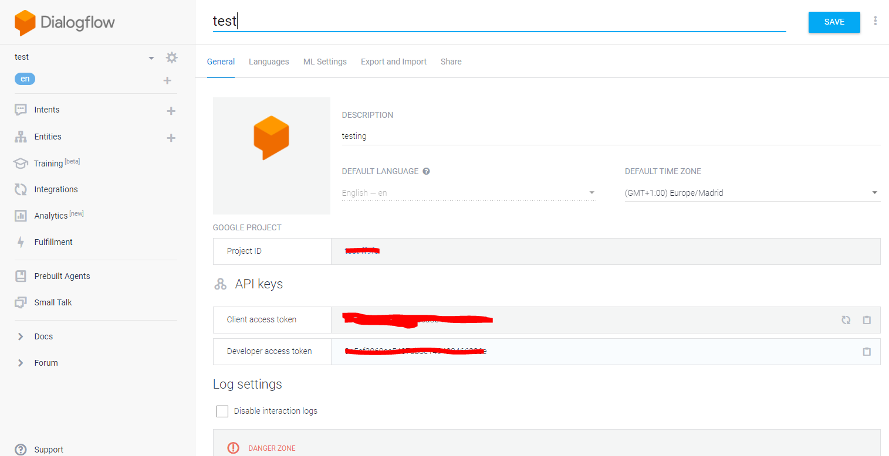
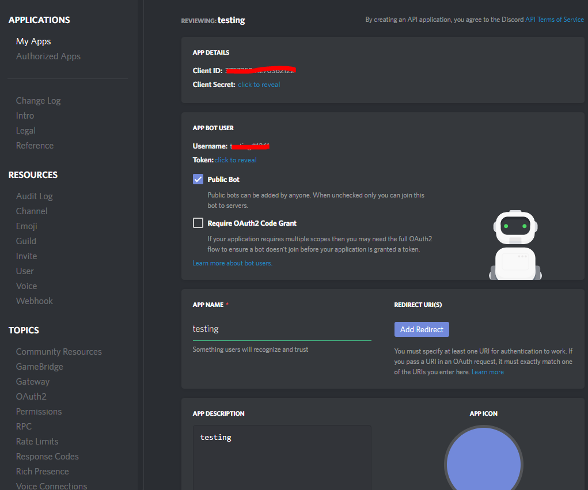

# Dialogflow2Discord

This is an integration for Discord for Dialogflow (API.AI). 
All you have to do to use this integration is change the config.js to include the tokens given by Dialogflow (API.AI) and Discord to run the index.js after downloading it.


## Getting Started

### Installing

```
npm install discorddialogflow --save
```

### Prerequites

Make sure to change the config.js file. You would need the get the token from discord and dialogflow.
```
module.exports = {
	Dialogflow: '<Enter your Dialogflow token here>',
	Discord: '<Enter your discord token here>'
}
```



### Running the service

This is all you have to do after changing the config.js. 😊
```
node index
```

## Built With

* [API.AI NodeJS Client](https://github.com/dialogflow/dialogflow-nodejs-client) - API.AI NodeJS SDK
* [Discord.js](https://discord.js.org/) - Discord.js

## Author

* **Haseem Isaac** - [Haseem Isaac](https://github.com/haseemisaac)

## License

This project is licensed under the MIT License - see the [LICENSE.md](LICENSE.md) file for details

